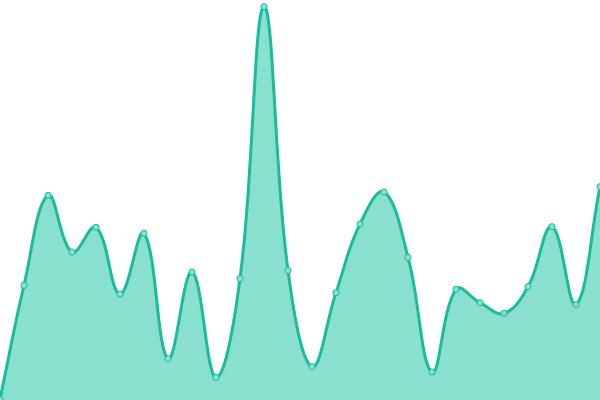
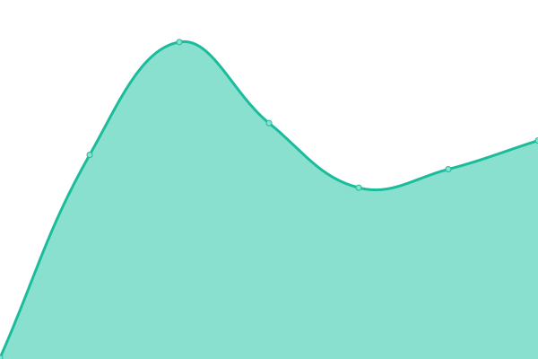

# [📈 Live Status](https://status.inutil.info): <!--live status--> **All micro-services are operational**

This repository contains the open-source uptime monitor and status page for [inUtil Labs](https://inutil.info), powered by [Upptime](https://github.com/upptime/upptime).

<!--start: status pages-->
<!-- This summary is generated by Upptime (https://github.com/upptime/upptime) -->
<!-- Do not edit this manually, your changes will be overwritten -->
<!-- prettier-ignore -->
| URL | Status | History | Response Time | Uptime |
| --- | ------ | ------- | ------------- | ------ |
|  [inUtil Labs](https://inutil.info) | 🟩 Up | [in-util-labs.yml](https://github.com/inUtil-info/status/commits/HEAD/history/in-util-labs.yml) | 

 307ms
     
 | 

<a href="https://status.inutil.info/history/in-util-labs">99.61%</a>
    

|  [gasolinBot](mqin.inutil.info) | 🟩 Up | [gasolin-bot.yml](https://github.com/inUtil-info/status/commits/HEAD/history/gasolin-bot.yml) | 

 179ms
     
 | 

<a href="https://status.inutil.info/history/gasolin-bot">96.43%</a>
    

|  whin | 🟩 Up | [whin.yml](https://github.com/inUtil-info/status/commits/HEAD/history/whin.yml) | 

 265ms
     
 | 

<a href="https://status.inutil.info/history/whin">96.01%</a>
    

|  monitorin | 🟩 Up | [monitorin.yml](https://github.com/inUtil-info/status/commits/HEAD/history/monitorin.yml) | 

 129ms
     
 | 

<a href="https://status.inutil.info/history/monitorin">96.03%</a>
    

|  tarifin | 🟩 Up | [tarifin.yml](https://github.com/inUtil-info/status/commits/HEAD/history/tarifin.yml) | 

 262ms
     
 | 

<a href="https://status.inutil.info/history/tarifin">96.46%</a>
    

|  [mqin](mqin.inutil.info) | 🟩 Up | [mqin.yml](https://github.com/inUtil-info/status/commits/HEAD/history/mqin.yml) | 

 131ms
     
 | 

<a href="https://status.inutil.info/history/mqin">72.54%</a>
    

|  canalin | 🟩 Up | [canalin.yml](https://github.com/inUtil-info/status/commits/HEAD/history/canalin.yml) | 

 512ms
     
 | 

<a href="https://status.inutil.info/history/canalin">95.90%</a>
    

|  [hookin](https://inutil.info) | 🟩 Up | [hookin.yml](https://github.com/inUtil-info/status/commits/HEAD/history/hookin.yml) | 

 35ms
     
 | 

<a href="https://status.inutil.info/history/hookin">99.61%</a>
    

|  [robotin](mqin.inutil.info) | 🟩 Up | [robotin.yml](https://github.com/inUtil-info/status/commits/HEAD/history/robotin.yml) | 

 129ms
     
 | 

<a href="https://status.inutil.info/history/robotin">96.52%</a>
    

<!--end: status pages-->

[**Visit our status website →**](https://status.inutil.info)

## 📄 License

- Powered by: [Upptime](https://github.com/upptime/upptime)
- Code: [MIT](./LICENSE) © [inUtil](https://inutil.info)
- Data in the `./history` directory: [Open Database License](https://opendatacommons.org/licenses/odbl/1-0/)
